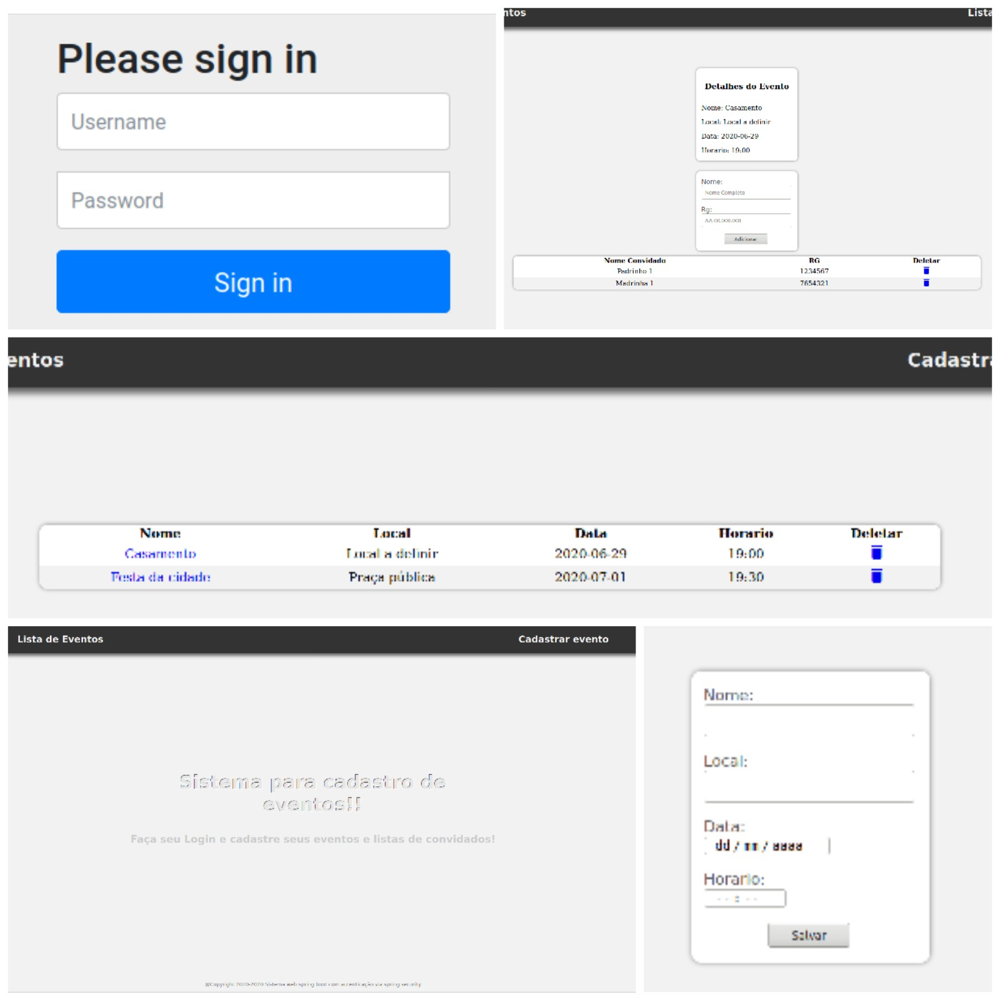

# Lista de Eventos

Aplicação que realiza o cadastro de eventos sociais com participação de pessoas. Pode-se cadastrar variados eventos assim como pessoas que irão participar dos mesmos.



### Tecnologias utilizadas

O sistema foi desenvolvido com **Spring Boot** + **Thymeleaf**, utilizando **Spring Secutiry** com autenticação via **JPA**.

### Iniciando o sistema em ambiente de desenvolvimento

Por se tratar de uma aplicação desenvolvida com intúito de abordar a parte de autenticação, alguns pontos não foram desenvolvidos. Com isso para que a aplicação seja iniciada e testada se faz necessária a execução dos seguintes sql's no banco de dados utilizado:

1. Inserir um usuário no Banco de login e senha **admin**
```
insert into usuario values('admin', 'Antonio', '$2a$10$L6ybvkOp4Li6IKGdekWt6Obx5VPzoyWYNoliYD80L.ANM4Ya7fqom');
```

2. Adicionar as regras de usuário e administrador para privilégio de páginas
```
insert into role values('ROLE_ADMIN');
insert into role values('ROLE_USER');
```

3. Adicionar o privilégio de administrador ao usuário criado
```
insert into usuarios_roles values('admin', 'ROLE_ADMIN'); 
```